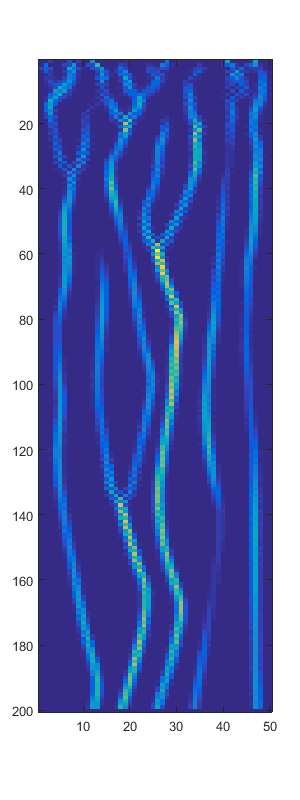

# toy_erosion_model

## What is this?
Code I wrote in 2012 (apparently) which implements a toy model of fluid falling through a random medium and collecting/depositing; creating natural channels based on the fine structure.

## How do I run it?
Run beginnererosion.m. This does a live animation in a for loop.

## Requirements
* Matlab/Octave. Runs in Octave 6.4.0 but should run in any version honestly.
